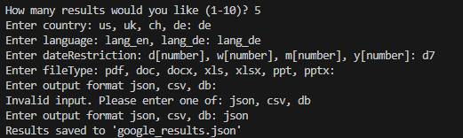
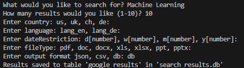

# Google Search Scraper

## 1. Zweck

This Python script performs a Google search using user-defined parameters and saves the results.

## 2. Funktionsweise

The script uses the Google Custom Search API and consists of the following main functions:

### `google_search_api(search_term, num_results=10, country=None, language=None, dateRestrict=None, fileType=None, **kwargs)`

This function executes the Google search with the specified parameters. It uses the Google Custom Search API.

**Parameters:**

* `search_term`: The search term.
* `num_results`: The number of results to return (Default: 10).
* `country`: Restricts the search to a specific country (e.g., "us", "uk", "de").
* `language`: Restricts the search to a specific language (e.g., "lang_en", "lang_de").
* `dateRestrict`: Restricts the search to a specific time period (e.g., "d7" for the last 7 days).
* `fileType`: Restricts the search to a specific file type (e.g., "pdf", "doc").
* `**kwargs`: Additional parameters supported by the Google Custom Search API.

**Returns:**

* A list of dictionaries, where each dictionary represents a search result with the keys "title", "link", and "snippet".
* `None` if an error occurs.

### `save_results(results, filename="google_results", output_format="json", db_name="search_results.db")`

This function saves the search results in the specified format.

**Parameters:**

* `results`: The search results returned by `google_search_api`.
* `filename`: The name of the output file or the name of the table in the database (Default: "google_results").
* `output_format`: The output format. Possible values are "json", "csv", and "db" (Default: "json").
* `db_name`: The name of the SQLite database (if `output_format` is "db") (Default: "search_results.db").

### `get_user_input(prompt, allowed_values=None)`

This function retrieves and validates user input.

**Parameters:**

* `prompt`: The input prompt displayed to the user.
* `allowed_values`: An optional list of allowed input values. If provided, the user's input is validated against these values.

**Returns:**

* The user's input as a lowercase string.

## 3. Anforderungen und Parametrisierung

The script meets the following requirements:

* **Result Storage:** The script supports saving results in the following formats:
    * JSON file: A human-readable format for data exchange.
    * CSV file: Suitable for spreadsheets and data analysis.
    * SQLite database: Enables structured storage and querying of data.
* **Parametrization:** The script is highly parameterized, allowing users to adjust search queries without modifying the code.
* The user is prompted to enter the following parameters:
    * Search term
    * Number of results
    * Country
    * Language
    * Time period
    * File type
    * Output format
* **Documentation:** This document serves as the script's documentation.

## 4. Verwendung

**Voraussetzungen:**

* Python 3 is installed.
* The necessary Python libraries are installed.
* Install the Google API client library:

    ```bash
    pip install --upgrade google-api-python-client
    ```

**Konfiguration:**

* Replace the placeholders `API_KEY` and `SEARCH_ENGINE_ID` in the script with your actual values.
* The API key is obtained from the Google Cloud Console.
* The Search Engine ID is retrieved from the Control Panel of the Programmable Search Engine.

**Execution:**

* Run the script from the command line:

    ```bash
    python skriptname.py
    ```
* The script will guide you through the process of entering the search parameters.
* The results will be saved in the specified format.

## 5. Beispiele

**Beispiel 1:** Search for the latest news on "Klimawandel" (Climate Change) and save it in JSON format.



**Beispiel 2:** Search for documents on "Machine Learning" and save them in a database.



## 6. Fehlerbehandlung

The script includes basic error handling for API request failures. In case of an error, an error message is printed, and `None` is returned.
